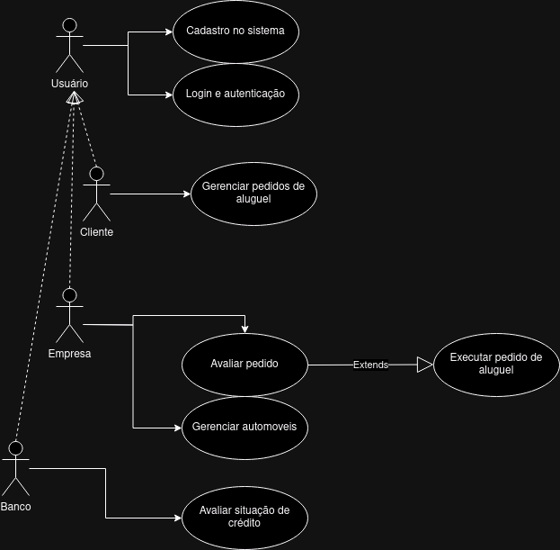
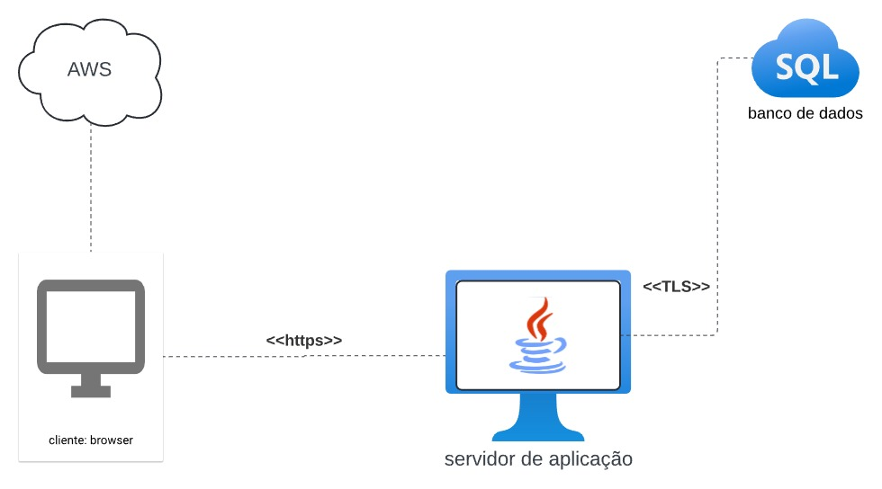

# LABORATÓRIO 02 - Sistema de Aluguel de Carros

O Laboratório 02 envolve o desenvolvimento de um Sistema de Aluguel de Carros para apoiar a gestão de locações, permitindo que clientes realizem pedidos de aluguel e agentes financeiros avaliem e aprovem esses pedidos. O sistema automatiza o processo de cadastro, consulta e modificação de pedidos, oferecendo uma plataforma integrada que facilita a comunicação entre clientes e agentes, garantindo agilidade e segurança nas transações.

## Alunos integrantes da equipe

- Pedro Henrique Pires Rodrigues
- Pedro Negri Leão Lambert
- Vinicius Rezende Arantes de Araujo Moreira

## Professores responsáveis

- João Paulo Carneiro Aramuni

## Diagrama de Classes

## Diagrama de Casos de Uso

## Diagrama de Componentes

## Diagrama de Implementação

## Diagrama de Implementação

## Histórias de Usuário

| **User Story**                        | **Descrição**                                                                                                                               |
| ------------------------------------- | ------------------------------------------------------------------------------------------------------------------------------------------- |
| US01 - Cadastro no Sistema            | Eu, como usuário, quero me cadastrar no sistema para acessar a plataforma de aluguel de automóveis.                                          |
| US02 - Login e Autenticação           | Eu, como usuário, quero realizar o login no sistema para acessar minhas funcionalidades.                                                     |
| US03 - Gerenciar Pedidos de Aluguel   | Eu, como cliente, quero gerenciar meus pedidos de aluguel para acompanhar o status e realizar alterações, se necessário.                     |
| US04 - Avaliar Pedido                 | Eu, como empresa, quero avaliar o pedido de aluguel para garantir que o cliente atende aos critérios para prosseguir com o aluguel.          |
| US05 - Executar Pedido de Aluguel     | [estende US04] Eu, como empresa, quero executar o pedido de aluguel após avaliação positiva, permitindo que o cliente retire o automóvel.     |
| US06 - Gerenciar Automóveis           | Eu, como empresa, quero gerenciar o inventário de automóveis para garantir a disponibilidade e manutenção adequada dos veículos.              |
| US07 - Avaliar Situação de Crédito    | Eu, como banco, quero avaliar a situação de crédito do cliente para confirmar sua capacidade de honrar o compromisso financeiro do aluguel.   |
